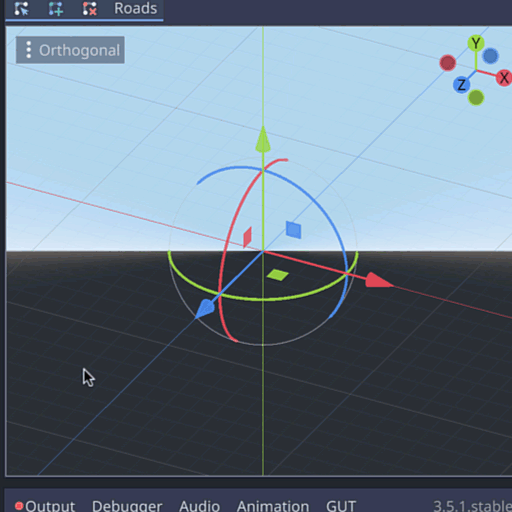
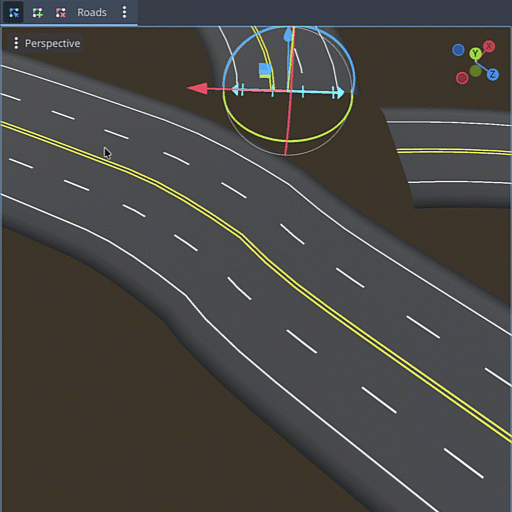
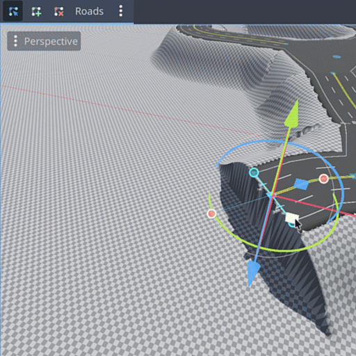
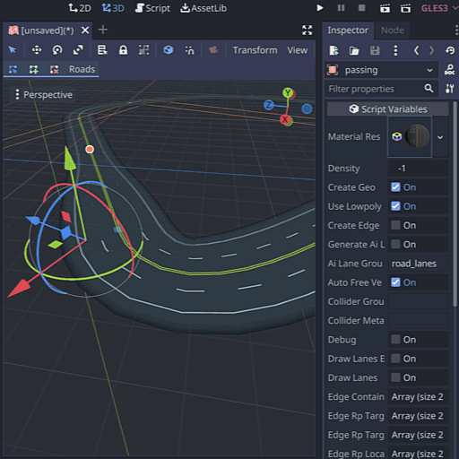
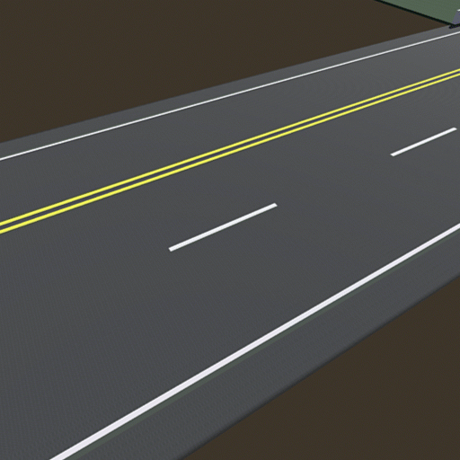
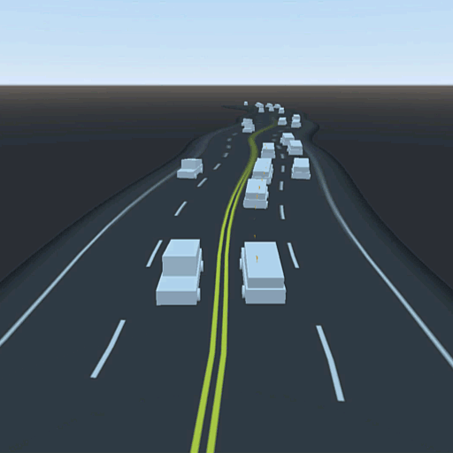
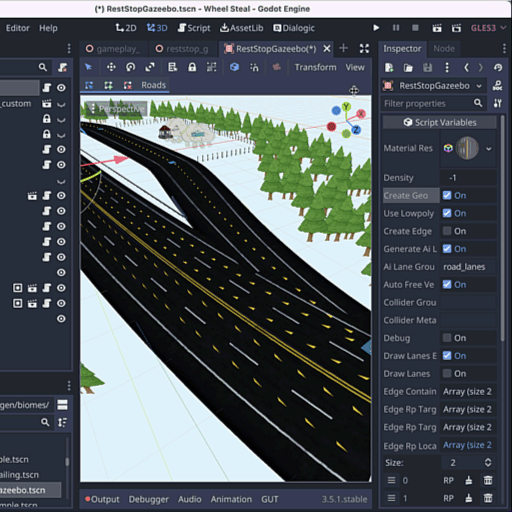
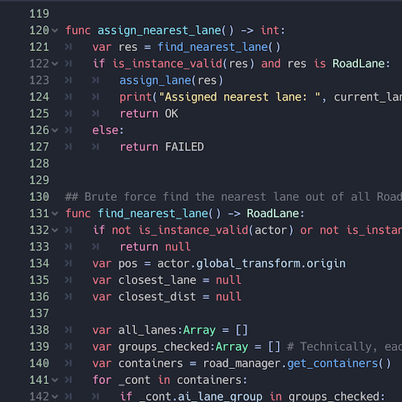

  

<h1 align="center">Godot Road Generator</h1>

A Godot plugin for creating flexible 3D highways and streets with traffic support

	
	
	
	
	

## Godot 4.x and 3.x support

> :warning: **This project is not feature complete yet**!

See [upcoming milestones](https://github.com/TheDuckCow/godot-road-generator/milestones).

| [Dev](https://github.com/TheDuckCow/godot-road-generator/tree/dev) | [Main](https://github.com/TheDuckCow/godot-road-generator/tree/main) | [godot3](https://github.com/TheDuckCow/godot-road-generator/tree/godot3) |
| --- | ---- | ------ |
| Latest, Godot 4.3+ | Released, Godot 4.x | Godot 3.x (deprecated) |

Currently, all new development occurs in the dev branch targeting Godot 4.3+. When a release is ready, the dev branch is merged into main (which is why main may look inactive).

## What problems this addon solves

Without this plugin, Godot users can create road ways in one of three ways:

1. Use a CSGPolygon following a path
	- While this is simple to set up and requires no plugins, it has many limitations
	- You need a custom material for every combination of lane sequences (1 way street, 2 lane road, multi lane highway).
	- There's no way to transition from one lane count to another without highly custom workarounds.
	- No easy way to create intersections without fiddly geometry placement.
	- Largely impossible to avoid geometry gaps between different segments of road
2. Make custom model roads in a 3D modelling software
	- This adds an extra barrier to entry, and not being dynamic, greatly limits the way you can create roads layouts in Godot.
3. Write own code to create road meshes
	- It should go without saying, this is extra work! And this is exactly what this plugin aims to provide.

In addition to each point above, each scenario requires you to make your own custom code to handle AI traffic that can follow lanes. Furthermore, even when comparing to road generators for other game engines, they lack features to create fine tuned lane shapes such as dynamic lane changes and per-RoadPoint settings. They also tend to focus on editor creation and lack the optimization for in-game procedural use cases.

## High level Features

| Feature | Demo |
| ------- | -----|
| **Scenetree-based building blocks.** Cross-sectional RoadPoint's define interpolating properties about road shape. Lane-control gizmo adjusts lane count, per RoadPoint or (holding shift) per entire RoadContainer. |  |
| **RoadContainer organization.** Group sibling RoadPoints, and snap together with other RoadContainers. Save a RoadContainer to a scene for reuse. |  |
| **RoadPoint inspector panel**. Define lane width, shoulder, and more. Hold shift to affect all RoadPoints within same container. |  |
| **Click-to draw with collision snapping**. Fine tune placement after using native 3D gizmo as needed. |  |
| **Procedural intersections.** Dynamically connect RoadPoints to create RoadIntersections. Supports non-planar setups. (RoadLane/edge curve support coming soon)|  |
| **Prefab intersection RoadContainers.** Snap together built-in four way, three way, and highway on/off ramps with ease. |  |
| **Terrain3D integration.** Flatten terrain to meet the level of your roads with options for margins and falloff. Format extendable for other terrain generators too. |  |
| **Multi-material support.** Separate surface and underside materials per RoadContainer. Source trim-sheet provided to guide creation of customized materials. |  |
| **Auto-generated AI paths.** Enable for automatic RoadLane placement, or hand place in your scene. Use the RoadLaneAgent helper to help agents follow roads, handling transitions between segments. |  |
| **Decoration edge curves.** Once enabled on a RoadContainer, add CSG path geometry or make your own scripts to instance assets along left, right, and center curves. |  |
| **Runtime-available functions for procedural use.** Operations apply on single RoadSegments at a time to be performant. |  |
| **Export RoadContainers to gLTF/glb.** Output sections of your road network to edit further in a 3D software, without exporting your whole scene. |  |
| **Support for custom-made meshes.** Turn off "Create Geo", then drop in your own meshes + colliders. AI paths remain connected. |  |
| **GDScript-only (for now)**. No extra compiling or dependencies to worry about. |  |

## Credits

This addon is developed by Moo-Ack! Productions as a part of the "Wheel Steal" game project. We poured a lot of effort, time, and money into making this an intuitive, highly functional addon - and we chose to give it away for free to the Godot community.

You can share you appreciation by:

1. Following or sharing the game project on [Bluesky](https://bsky.app/profile/wheelstealgame.bsky.social) or [Instagram](https://www.instagram.com/wheelstealgame/)
1. Joining the [Wheel Steal discord](https://discord.gg/gttJWznb4a)
1. Becoming a [Patron of the project](https://www.patreon.com/WheelStealGame) (see special Roadside Support tier for hands on support)

Further contributions by [antonkurkin](https://github.com/antonkurkin), [NoJoseJose](https://github.com/NoJoseJose), and [more here](https://github.com/theduckcow/godot-road-generator/graphs/contributors).

Logo designed by [Kenney](https://www.kenney.nl/assets).

## How to install and use

Follow the [Getting Started tutorial here](https://github.com/TheDuckCow/godot-road-generator/wiki/A-getting-started-tutorial). If you clone the entire repository, you can also see example usage by checking out the "Museum" demo scene.

Then, check out the [wiki pages](https://github.com/TheDuckCow/godot-road-generator/wiki) for more detailed usage.

## Games made with the Road Generator

*Want to include yours? [Create an issue](https://github.com/TheDuckCow/godot-road-generator/issues/new)!*

- [Wheel Steal Game](https://wheelstealgame.com/) - procedural use case
- [Wheelie Big and Small](https://theduckcow.itch.io/wheelie-big-and-small) - procedural use case
- [Makin'Paper / Racin'Paper](https://theduckcow.com/2024/paper-games-win-hearts-gdko-2024/) - editor created tracks

## Future plans

All development ideas are added as [enhancement issues here](https://github.com/TheDuckCow/godot-road-generator/issues?q=is%3Aopen+is%3Aissue+label%3Aenhancement). All *prioritized* issues are part of milestones [defined here](https://github.com/TheDuckCow/godot-road-generator/milestones)

## Contribution

Contributions are welcomed! See the [contributing guide](https://github.com/TheDuckCow/godot-road-generator/blob/main/CONTRIBUTING.md) for all the details on getting started.
