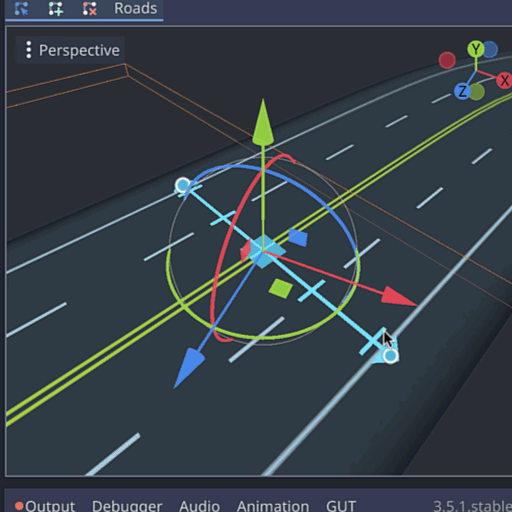
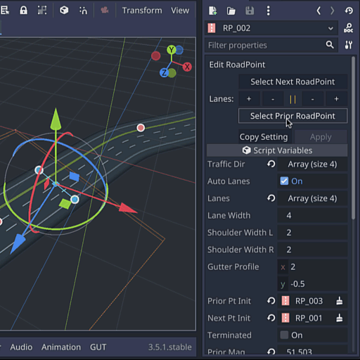
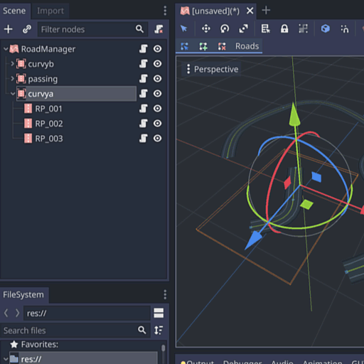
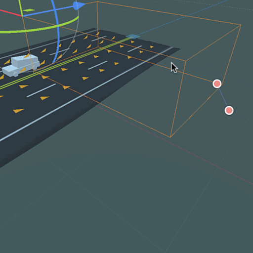

# Godot Road Generator

A Godot plugin for creating 3D highways and streets.

> :warning: **This project is not feature complete yet**!

See [upcoming milestones](https://github.com/TheDuckCow/godot-road-generator/milestones).

## Godot 3.x and 4.x support

Current status:

| [Dev](https://github.com/TheDuckCow/godot-road-generator/tree/dev) | [Main](https://github.com/TheDuckCow/godot-road-generator/tree/main) | [godot4](https://github.com/TheDuckCow/godot-road-generator/tree/godot4) |
| --- | ---- | ------ |
| For godot 3.x | For godot 3.5 ([Asset Library](https://godotengine.org/asset-library/asset/1934)) | For godot 4.3 ([Asset Library pending](https://godotengine.org/asset-library/asset/14069)) |
| Latest updates, may be unstable | Latest release (v0.5.1) | Latest release (v0.5.1) | 

Currently, all new development begins in the Godot 3.x dev branch.

When a release is ready, the dev branch is merged into main (which is why main may look inactive). After such releases, manual time is spent to migrate the godot 3.x release into the godot4 branch, which may take several days. 

Once the project reaches initial alpha feature completion (public 1.0), future releases will only target Godot 4.0+. The Godot 3.5 builds shared before v1.0 will be provided as-is and without further maintenance after the 1.0 launch.

## What problems this addon solves

Without this plugin, Godot users can create road ways in one of three ways:

1. Use a CSGPolygon following a path
	- While this is simple to set up and requires no plugins, it has many limitations
	- You need a custom material for every combination of lane sequences (1 way street, 2 lane road, multi lane highway). Additionally, there's no way to transition from one lane count to another without highly custom workarounds.
	- Editing road points using native curve point handles is awkward and not precise, which is not great for fine-tuned placement.
	- No easy way to create intersections without fiddly geometry placement.
2. Custom model roads in a 3D modelling software
	- This adds an extra barrier to entry, and not being dynamic, greatly limits the way you can create roads layouts in Godot.
3. Write their own code to create road meshes
	- It should go without saying, this is extra work! And this is exactly what this plugin aims to provide.

In addition to each point above, each scenario requires you to make your own custom code to handle AI traffic that can follow lanes. Furthermore, even when comparing to road generators for other game engines, they lack features to create fine tuned lane shapes such as dynamic lane changes and per-roadpoint settings. They also tend to focus on editor creation and lack the optimization for in-game procedural use cases.

## High level Features

| Feature | Demo |
| ------- | -----|
| RoadPoints, the primary road building block. They have their own lane-control gizmo, hold shift to affect all RoadPoints in this RoadContainer. |  |
| Click-to draw, full spatial controls to fine tune placement after. Will snap to colliders on click if any. |  |
| RoadPoint inspector panel to define lane width, shoulder, and more. Hold shift to affect all RoadPoints within same container. |  |
| RoadContainers to organize roads and snap roads together. Save a RoadContainer out to a scene for reuse! |  |
| Changeable materials per RoadContainer. Source trim-sheet vector is provided to guide creating your own customized materials. |  |
| Optional auto-generated AI path lanes. You can also manually define AI paths to link up roads. A provided RoadLaneAgent makes for easy navigation. |  |
| Runtime-available functions for procedural use cases, operations apply on single RoadSegments at a time to be performant. |  |
| Support for custom-made meshes. Turn off "Create Geo", then drop in your own meshes + colliders. AI paths remain connected. |  |
| GDScript-only (for now), no extra compiling or dependencies to worry about. |  |
| ***[Planned](https://github.com/TheDuckCow/godot-road-generator/issues/121), not implemented:*** Procedural intersections. Can currently create using pre-saved scenes with custom geometry per above. |  |

## Credits

This addon is developed by Moo-Ack! Productions as a part of the "Wheel Steal" game project. We poured a lot of effort, time, and money into making this an intuitive, highly functional addon - and we chose to give it away for free to the Godot community.

You can share you appreciation by:

1. Following or sharing the game project on [Bluesky](https://bsky.app/profile/wheelstealgame.bsky.social), [Twitter](https://twitter.com/WheelStealGame). or [Instagram](https://www.instagram.com/wheelstealgame/)
1. Joining the [Wheel Steal discord](https://discord.gg/gttJWznb4a)
1. Becoming a [Patron of the project](https://www.patreon.com/WheelStealGame) (see special Roadside Support tier for special support)

Logo specially designed by [Kenney](https://www.kenney.nl/assets) for this project.

## How to install and use

Follow the [Getting Started tutorial here](https://github.com/TheDuckCow/godot-road-generator/wiki/A-getting-started-tutorial).

Then, check out the [wiki pages](https://github.com/TheDuckCow/godot-road-generator/wiki) for more detailed usage.

## Games made with the Road Generator

*Want to include yours? [Create an issue](https://github.com/TheDuckCow/godot-road-generator/issues/new)!*

- [Wheel Steal Game](https://wheelstealgame.com/) - procedural use case
- [Wheelie Big and Small](https://theduckcow.itch.io/wheelie-big-and-small) - procedural use case
- [Makin'Paper / Racin'Paper](https://theduckcow.com/2024/paper-games-win-hearts-gdko-2024/) - editor created tracks

## Future plans

All development ideas are added as [enhancement issues here](https://github.com/TheDuckCow/godot-road-generator/issues?q=is%3Aopen+is%3Aissue+label%3Aenhancement). All *prioritized* issues are part of milestones [defined here](https://github.com/TheDuckCow/godot-road-generator/milestones)

## Contribution

Contributions are welcomed! See the [contributing guide](https://github.com/TheDuckCow/godot-road-generator/blob/main/CONTRIBUTING.md) for all the details on getting started.
